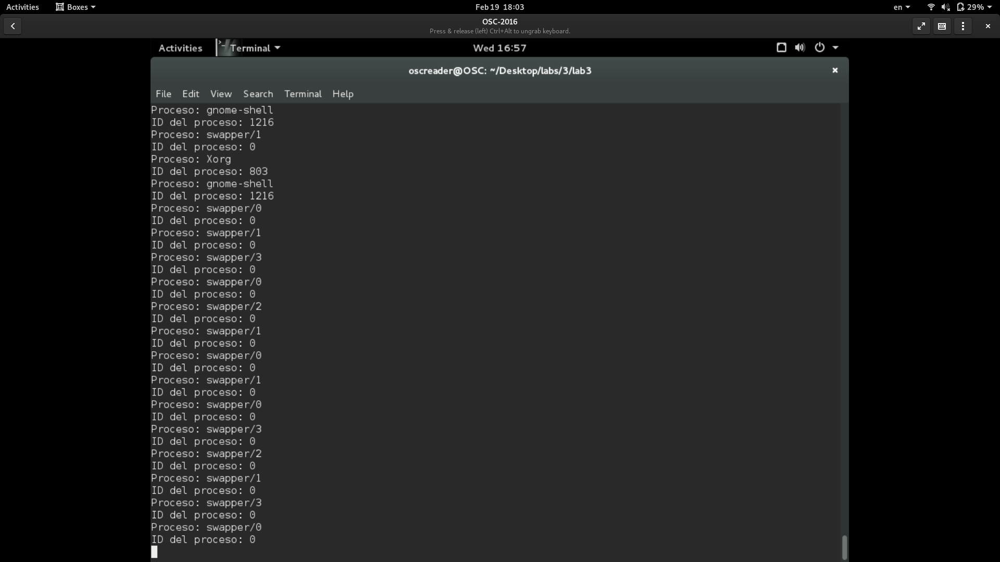
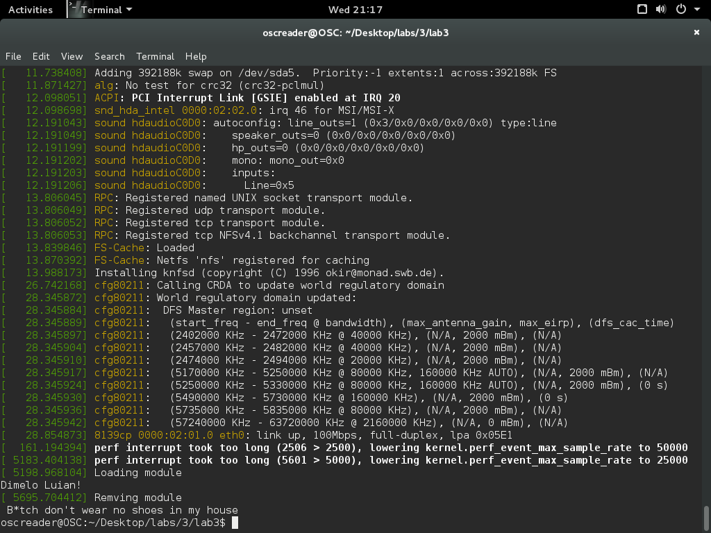
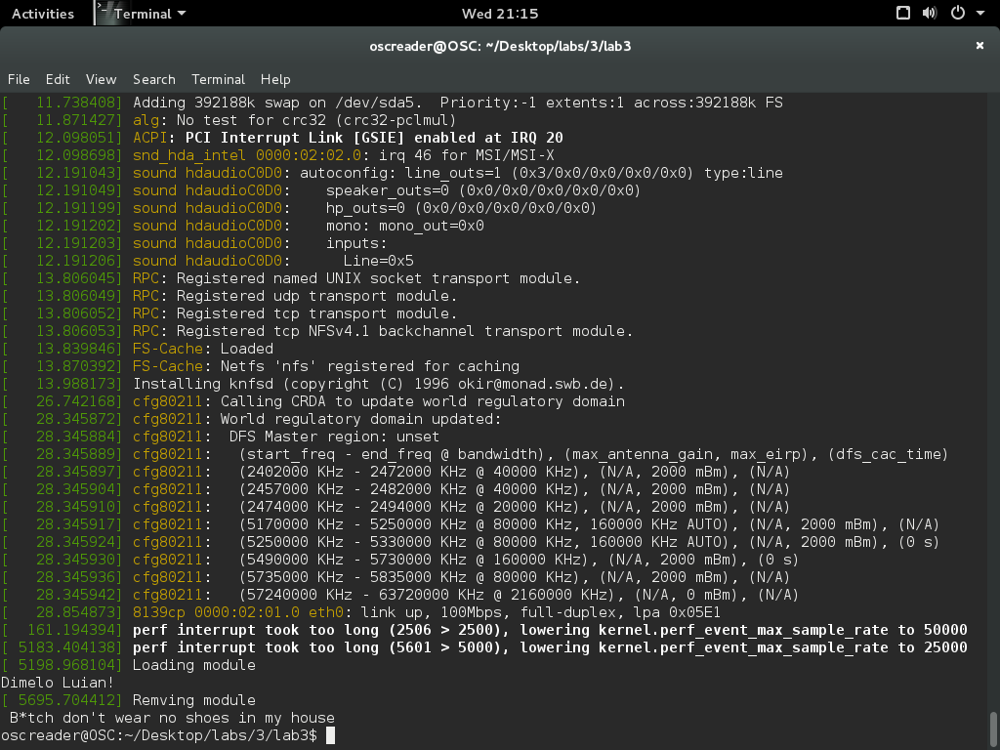
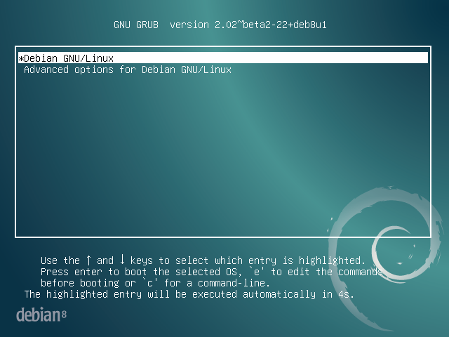
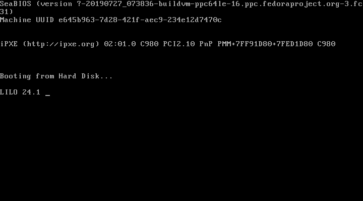

# Laboratorio 3
## Autores
- Josue Valenzuela

## Ejercicio 1
```c
probe timer.profile {
	printf("Proceso: %s\n", execname())
	printf("ID del proceso: %d\n", pid())
}
```

### Ejecucion
```bash
$ sudo stap profiler.stp
```



- ¿Qué puede ver en el output cuando realiza estas acciones?

    Muestra el nombre y el ID del proceso que se esta ejecutando.

- ¿Para qué sirve SystemTap?

    Es una herramienta que incluye una interfaz de comandos y un lenguage de *scripting* para la instrumentacion dinamica de sistemas operativos basados en el kernel de `linux`

- ¿Qué es una probe?

    Son *scripts* exploratorios, que definen los puntos que se van a analizar on systemtap. Estos asocian eventos abstractos a los bloques de declaracion.

- ¿Cómo funciona SystemTap?

    [Articulo redhat](https://access.redhat.com/documentation/en-us/red_hat_enterprise_linux/5/html/systemtap_beginners_guide/understanding-how-systemtap-works)

- ¿Qué es hacer profiling y qué tipo de profiling se hace en este ejercicio?

    *Profiling* es el analisis dinamico de un programa basado en distintas mediciones como puede ser consumo de memoria, tiempo de ejecucion *etc*.

    Desde el punto de vista de la salida del profiler, es un profiling *flat*, tambien funciona como un profiler basado en eventos.

## Ejercicio 2

- ¿Cuál es la diferencia en C entre un método que no recibe parámetros y uno que recibe void?

    Cuando una funcion esta definida como `func()` no tienen parametros, ni prototipo. Esto quiere decir que al momento de llamarla se pasan parametros, la ejecucion sera normal.

    Si una funcion e definida `func(void)` no tienen parametros pero tienen prototipo, es decir, cuando si se llama la funcion enviandole parametros esto dara una excepción.

- ¿Qué diferencia hay entre printky printf?

    `printk` es una funciona nivel de kernel, que sirve para los logs en distintos niveles definidos en `<linux/kernel.h>`. `printf`escribe a un *file descriptor* o a `STD_OUT`

- ¿Qué es y para qué sirve `KERN_INFO`?

    Es el nivel de log en el que se escribe. El nivel define el tipo de log quese esta escribiendo.

- ¿Qué es una goal definition o definición de meta en un Makefile,y qué se está haciendo con ladefinición de meta obj-m?

    La meta es el target que make va a actualizar, o tratar de actualizar. Este actualiza todos los modulos que sea requisistos de una meta.

    En la definicion de `obj-m` es la meta a la que se debe de llegar, y el valor que se le asigna es el como se van a escribir los resultados. Esta especifica los archivos `object` 

- ¿Qué función tienen las líneas all:y clean:?

    Estos son *Phony Targets* son funciones que se ejecutan solamente si se llaman explicitamente. `all` compila todos los archivos que sean necesarios para llegar al *goal* y `clean` limpia luego de compilacion.

- ¿Qué hace la opción `–C` en este Makefile?

    Segun la paggina del manual de make
    >Change to DIRECTORY before doing anything.
    
    Esto quiere decir que se cambiara el directorio de trabajo como primer paso/

- ¿Qué hace la opción Men este Makefile?

    Segun la paggina del manual de make
    > The M= option causes that makefile to move back into your module source directory before trying to build the modules target.

    Esto guarda un valor en la variable M, que es al directorio donde se mueve make.



- ¿Para qué sirve dmesg?

    Comando es utilizado para examinar o controlar el buffer del kernel, por defecto se usa para leer los mensajes (como los logs) del kernel.

- ¿Qué hace la función simple_init en su programa simple.c?
    
    Es la funcion que esta encargada de cargar el modulo al kernel de linux.
    


- ¿Qué hace la función simple_exiten su programa simple.c?

    Se encargar de descargar el mudlo del kernel.

- Usted  ha  logrado  crear,  cargar  y  descargar  un  módulo  de  Linux.  ¿Qué poder  otorga  el ejecutar código de esta forma?

    Concede permisos en el espacio del kernel, es decir se tiene las funciones que el kernel puede ejecutar. Cabe mencionar la facilidad de cargar los modulos al sistema para reducir el tiempo de desarrollo/deploy.

## Ejercicio 3 
 - ¿Qué es y para qué sirve el archivo fstab?

    Es la tabla del sistema de archivos del sistema operativo, se utiliza para *montar* dispositivos con sistemas de archivos de manera automatica, o en un orden personalizado.

- ¿Qué almacena el directorio /etc? ¿En Windows, quién (hasta cierto punto) funge como /etc?

    En su mayoria almacena archivos de configuracion (tablas de configuracion, configuraciones ejectables, *etc*), aunque tambien incluye archivos allow/deny para dar permisos de acceso.

    En windows podria llamarse 'equivalente' a system32

- ¿Qué se almacena en `/dev` y en `/dev/disk`?

    En `/dev` se almacena los archivos de dispositivos (Los dispositivos contectados son representados como un archivo). En `/dev/disk` se almacena los archivos de los dispositivos que son reconocidos como discos.

- ¿Por qué se usa <la dirección completadel link hacia sda>en lugar de sólo /dev/sda, y cuál es el papel que el programa `udev `cumple en todo esto?

    Se utiliza como un identificador al dispositivo fisico, y el punto en donde se accede. Estos links estan basados en el nombre de los dispositivos, por lo que es mas sencillo identificarlos. `udev` es el administrador de dispositivos del kernel de linux, este es el encargado de crear los nodos de disko (links) en `/dev/disk/by-id`.

- ¿Qué  es  un block  devicey  qué significado  tiene sdxN,  dondexes  una  letra  yNes  un número, en direcciones como /dev/sdb?Investiguey expliquelos conceptos de Master Boot Record(MBR) y Volume Boot Rercord(VBR), y su relación con UEFI.

    Son dispositivos virtuales ques solo dan acceso a el hardware por bloques. Se pueden conocer como particiones logicas. MBR y VBR son las particiones de booteo.

- ¿Qué es hacer chain loading?

    Chain loading es reemplazar un programa que se esta ejecutando por uno nuevo.

- ¿Qué   se   estáindicando   con   la   configuraciónroot=”<el  file  system anotado>”?

    Se indica donde se esta montando la raiz del sistema de archivos.

- ¿Qué es vmlinuz?

    Es el archivo ejecutable del kernel de linux. Se encuentra comprimido y es booteable.


### Funcionamiento con GRUB


### Funcionamiento con LILO


### Diferencias entre Grub y Lilo

 1. Lilo no tienen la capacidad de arrancar desde una red, mientras que grub si.
 2. Al agregar un nuevo sistema operativo, lilo se debe de configurar manualmente, mientras que grubes configurado de maneradinamica.
 3. A lilo se le debe de espicificar donde se encuentra en archivo del kernel, mientras que grub es capaz de encontrarlo.